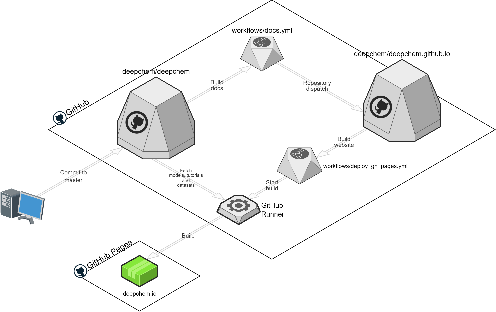

# deepchem.io
Website for DeepChem - https://deepchem.io.

## Instructions
### Setting Up
- Install dependencies using `npm i` in the `/deepchem/` directory

### Run
- Execute `npm run dev` to start a dev server
- Run `npx next dev -H <hotspot-ip> -p 3000` to test on mobile devices

### Build
- Execute `npm run build`

### Lint
- Execute `npm run lint`

## TechStack
- [Next-13](https://nextjs.org/blog/next-13)
- [TailwindCSS](https://tailwindcss.com/)

## Features
- Models
- Datasets
- Tutorials

## Links
- [UI/UX](https://www.figma.com/file/lx8RDjCI7XyzLeUMmP7tCw/DeepChem?node-id=0%3A1&t=fen0Nhme contributers

## Adding users and contributers to the carousels in home page and about page
- To add an organisation to the `Used by Scientific Leaders` section, add the the logo of the new organisation to the `/deepchem/public/used-by ` directory
- To add an organisation to the `Companies and Universities developing Deepchem` section in the About page, add the the logo of the new organisation to the `/deepchem/public/about/companies-developing-deepchem` directory
- File names can be flexible, but should be meaningful and represent the organisation
- Files must be .png files with transparent backgrounds

## Workflow

